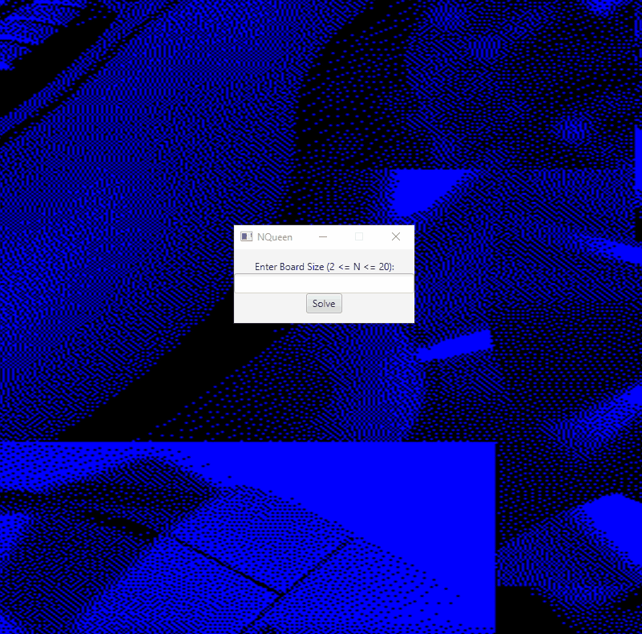
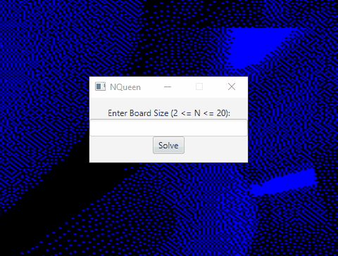

NQueen Problem - GUI
========================
Created by : Davis Insua

ABOUT 
----------------

This is a Java application that solves the NQueen problem for a given N (within specified range), and presents a new window with the solution as a graphic. The application uses helper functions to identify which spaces the queen cannot be attacked (sharing a row, column, or diagonal with another queen) and converts this to a GUI output. The program utilizes the JavaFX application platform for the UI elements, an adaptive interface that adjusts to the solved NQueen output, and the ArrayList data structure + nested loops to efficiently set up the solution graphic for viewing.

USAGE 
----------------

The application is used by typing in the desired square chessboard size N into the text field, clicking solve, and viewing the output.

DEMO  
----------------

Below are demo animations showing regular use of the program.

Demo of inputting valid entries into the application (numbers in range).

Demo of inputting invalid entries into the application (text, numbers out of range, no solution).

